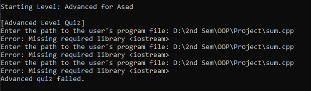

# Quiz Application
   Title: EDU-Play: An Interactive C++ Learning Game

## Overview
This project is a quiz application with multiple levels (Beginner, Intermediate, Advanced) that tracks user progress and maintains a leaderboard using a Binary Search Tree (BST). It supports user registration, login, and saving progress between sessions.

## Features
- Multi-level quiz system.
- User progress tracking.
- Leaderboard with rankings.
- Support for custom quizzes with validation checks for user code.

## Installation Instructions
1. Clone the repository:
   ```bash
   git clone https://github.com/h-1378-s/quiz_app

## Usage Guide
Start the Program:
Launch the program and follow the menu options to either log in or register a new account.

Play Quizzes:

Progress through the levels: Beginner → Intermediate → Advanced.
Answer questions in a queue-based format and earn points for correct answers.
Track Progress:

Your progress is saved after each level, allowing you to resume from where you left off.
Leaderboard:

View the leaderboard to see user rankings based on their best scores and total points.
Find User Stats:

Search for a specific user to view their total points, best score, and attempts.

## Results

Menu:


Records:


Progress Tracking: User progress is stored in a file and retrieved upon login.


Leaderboard: The leaderboard ranks users based on their best scores, displayed in descending order.


Error Checking: The Advanced quiz level validates user-provided C++ code for variable naming, semicolons, and required libraries.




